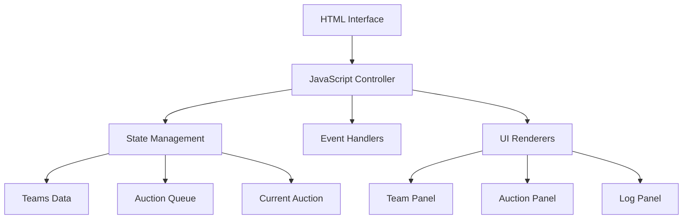

# 🏆 Team Draft Auction Dashboard

> **Auction-style team composition** real-time web dashboard inspired by Korean streaming culture

A simulation tool where 20 participants form teams through auction mechanics. Team captains use points to bid for desired players in auctions, while remaining players can freely choose their preferred teams.

## ✨ Key Features

- **👥 Participant Management**: Register up to 20 participants and assign team captains
- **💰 Real-time Auction**: Captains conduct player auctions with 1,000 points each
- **📊 Team Dashboard**: Real-time monitoring of remaining points, members, and team sizes
- **🎯 Free Selection**: Remaining players choose teams after auction ends
- **📝 Activity Log**: Complete tracking and recording of all auction processes
- **💭 Live Notes**: Note-taking functionality during auction progress

## 🚀 Quick Start

1. **Download Files**
   ```bash
   git clone https://github.com/fillgeun/Saenatae_dashboard.git
   cd Saenatae_dashboard
   ```

2. **Run in Browser**
   ```
   Drag sujeongbon.html to browser or double-click to open
   ```

3. **Start Using**
   - Enter 20 participants
   - Set number of teams and assign captains
   - Begin auction!

## 📖 Detailed Usage

### Step 1: Basic Setup
```
Enter Participants → Set Team Count → Assign Captains → Apply Settings
```

### Step 2: Auction Process
```
Start Auction → Register Items → Bid → Accept/Skip → Repeat
```

### Step 3: Free Selection
```
End Auction → Start Free Selection → Assign Remaining Players
```

### Key Rules
- **Initial Points**: 1,000 points per team captain
- **Bidding Limits**: Within remaining points, higher than current bid
- **Target Size**: 3-8 members per team (recommended: 5)
- **Auction Order**: Proceeds in order of item registration

## 🛠 Tech Stack

- **Frontend**: HTML5, CSS3, JavaScript (Vanilla)
- **Storage**: Browser Memory (single session)
- **UI/UX**: Responsive Grid Layout, Dark Theme
- **Browser**: Chrome, Firefox, Safari, Edge support

## 📱 Screen Layout

```
┌─────────────────────────────────────────────────────────┐
│ Header: Progress Stage Display                          │
├─────────────┬─────────────────────┬─────────────────────┤
│ Left (300px)│ Center (Flexible)    │ Right (480px)       │
│             │                     │                     │
│ • Basic     │ • Item Registration │ • Team Status       │
│   Setup     │ • Current Auction   │ • Activity Log      │
│ • Participant│ • Bid/Accept       │ • Live Notes        │
│   Input     │   Processing        │                     │
│ • Team      │ • Free Selection    │                     │
│   Settings  │                     │                     │
│ • Stage     │                     │                     │
│   Control   │                     │                     │
└─────────────┴─────────────────────┴─────────────────────┘
```

## 🎮 Use Cases

### Gaming/Sports Team Formation
- Gaming guild team composition
- Sports event team division
- Project team formation

### Education/Event Management
- Classroom group formation
- Workshop team creation
- Club team division

## ⚠️ Important Notes

- **Data Persistence**: All data resets on page refresh
- **Browser Compatibility**: Modern browsers required (IE 11 and below not supported)
- **Concurrent Access**: Single screen usage (multiplayer not supported)

## 🔧 Customization

### Modify Points
```javascript
// Change initial points (default: 1000)
points: 1500  // line ~350
```

### Change Color Theme
```css
:root {
  --accent: #6ea8fe;     /* Primary color */
  --accent-2: #22c55e;   /* Success color */
  --warn: #f59e0b;       /* Warning color */
}
```

### Modify Team Limit
```html
<input type="number" id="teamCount" max="10" />  <!-- Max 10 teams -->
```

## 📄 License

```
MIT License - Free to use, modify, and distribute
```

## 🤝 Contributing

1. Fork the Project
2. Create your Feature Branch (`git checkout -b feature/AmazingFeature`)
3. Commit your Changes (`git commit -m 'Add some AmazingFeature'`)
4. Push to the Branch (`git push origin feature/AmazingFeature`)
5. Open a Pull Request

## 📞 Support & Bug Reports

- **Issues**: Use GitHub Issues tab
- **Feature Requests**: Register issues with Enhancement label
- **Bug Reports**: Report with Bug label including detailed information

## 🎯 Roadmap

- [ ] **Multi-language Support** (한국어, 日本語)
- [ ] **Data Export** (JSON, CSV)
- [ ] **Team Balance Analysis** features
- [ ] **Mobile Optimization** 
- [ ] **Real-time Multiplayer** support
- [ ] **Custom Themes** functionality

## 📊 Project Information

- **Version**: 1.0.0
- **Last Updated**: August 20, 2025
- **Development Environment**: HTML5, Vanilla JavaScript
- **License**: MIT
- **AI Generated**: Created with Perplexity AI Assistant

***

**⭐ If this helped you, please give it a Star!**

```
Made with ❤️ and AI assistance
```

## 🌐 Language Versions

- **한국어**: [README_KR.md](README_KR.md)
- **English**: README.md (this file)
- **日本語**: [README_JP.md](README_JP.md) *(coming soon)*

## 🔗 Demo & Screenshots

### Main Dashboard


### Auction Process


### Team Status


*Note: Screenshots will be added in the next update*

## 🏗 Architecture Overview



## 📈 Performance

- **Load Time**: < 1 second
- **Memory Usage**: ~5MB typical
- **Supported Users**: 20 participants per session
- **Browser Requirements**: ES6+ support