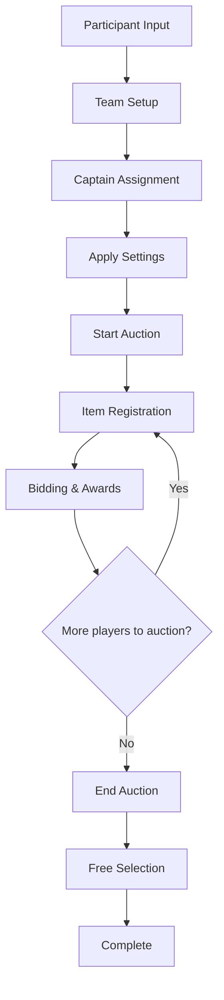

# 📖 Team Draft Auction Dashboard Complete User Manual

## 📋 Table of Contents

### 🎯 **Overview**
- [Overall Process Flow](#overall-process-flow)
- [⚠️ Critical Warnings](#critical-warnings)

### 📝 **Step 1: Basic Setup**
- [1-1. Participant Input](#1-1-participant-input)
- [1-2. Team Configuration](#1-2-team-configuration)  
- [1-3. Captain Assignment](#1-3-captain-assignment)
- [1-4. Apply Settings](#1-4-apply-settings)

### 🏁 **Step 2: Start Auction**
- [2-1. Enter Auction Phase](#2-1-enter-auction-phase)
- [2-2. Item Registration](#2-2-item-registration)

### 💰 **Step 3: Auction Process**
- [3-1. Current Auction Screen Layout](#3-1-current-auction-screen-layout)
- [3-2. Detailed Bidding Guide](#3-2-detailed-bidding-guide)
- [3-3. Winning Bids and Auction Completion](#3-3-winning-bids-and-auction-completion)

### 🎯 **Step 4: Free Selection**
- [4-1. End Auction](#4-1-end-auction)
- [4-2. Start Free Selection](#4-2-start-free-selection)
- [4-3. Player Team Assignment](#4-3-player-team-assignment)

### 📊 **Status Monitoring**
- [Team Status Panel](#team-status-panel)
- [Activity Log](#activity-log)
- [Real-time Notes](#real-time-notes)

### ⚠️ **Error Situations**
- [Setup Phase Errors](#setup-phase-errors)
- [Auction Phase Errors](#auction-phase-errors)
- [Bidding Phase Errors](#bidding-phase-errors)
- [Award Phase Errors](#award-phase-errors)

### 💡 **Advanced Usage**
- [Efficient Auction Management](#efficient-auction-management)
- [Captain Strategy Guide](#captain-strategy-guide)
- [Free Selection Phase Guide](#free-selection-phase-guide)

### 🔧 **Management Tools**
- [Complete Reset](#complete-reset)
- [Log Management](#log-management)
- [Notes Usage](#notes-usage)

### 📱 **Technical Information**
- [Browser Optimization](#browser-optimization)
- [System Requirements](#system-requirements)

### 🎪 **Use Cases**
- [Gaming Guild Team Formation](#gaming-guild-team-formation)
- [Sports Event Team Division](#sports-event-team-division)
- [Project Team Formation](#project-team-formation)

***

## ⚠️ **Critical Warnings**

### 🚨 **Data Persistence and Modification Limitations**

**This system operates as a single-session tool. Please be aware of the following:**

#### **❌ Data Cannot Be Modified**
- **Participant Name Changes**: Names cannot be edited once entered
- **Captain Changes**: Captains cannot be changed after settings are applied
- **Bid Cancellations**: Completed awards cannot be reversed
- **Bid Modifications**: Submitted bids cannot be changed

#### **❌ Error Scenarios**

**Incorrect Participant Input**:
```
Wrong input: "John Smithh" (typo)
→ Complete reset required to restart
```

**Incorrect Captain Assignment**:
```
Error: Same person assigned as captain for multiple teams
→ Can be fixed in dropdown before applying settings
→ Complete reset required after settings are applied
```

**Incorrect Awards**:
```
Error: Player A awarded to Team B but wanted for Team C
→ Cannot be modified → Complete reset and restart required
```

#### **❌ Data Loss Risks**
- **Page Refresh**: All data immediately lost
- **Browser Close**: Progress completely deleted
- **Back Button**: Potential data loss
- **Site Navigation**: Current state not saved

#### **✅ Recommendations for Safe Usage**

**1. Thorough Preparation**
```
□ Prepare accurate participant list (copy-ready text file)
□ Pre-select captain candidates
□ Calculate team count and target size in advance
□ Plan auction progression order
```

**2. Careful Step-by-Step Verification**
```
□ Check participant names for typos
□ Verify team count and target size accuracy
□ Ensure no duplicate captain selections
□ Review all information before applying settings
```

**3. Error Prevention Checklist**
```
Setup Phase:
□ 20 participants correctly entered ✓
□ Team count properly configured ✓  
□ Captains selected without duplicates ✓
□ "Captain setup completed" message confirmed ✓

Auction Phase:
□ Desired players added to queue ✓
□ Bidding captain correctly selected ✓
□ Bid amount accurately entered ✓
□ Final confirmation before award ✓
```

**4. Backup Plan**
```
□ Record important interim results in notepad
□ Take screenshots of team status periodically
□ Save activity log contents separately
□ Decide on immediate complete reset if errors occur
```

#### **💡 Error Minimization Tips**

**Proceed Slowly**:
- ⏰ Don't rush - **proceed carefully step by step**
- 👥 **Verify with participants** during process
- 🔍 **Review each step** before proceeding

**Double-Check Habits**:
- ✅ **"Is this correct?"** re-confirmation before important decisions
- ✅ **Check all information** before applying settings
- ✅ **Final confirmation** before awards

***

## 🔍 **Quick Reference**

### ⚡ **Core Process Summary**
```
Participant Input → Captain Assignment → Start Auction → Item Registration → Bidding → Award → Free Selection → Complete
```

### 🚨 **Common Errors**
- ❌ **Duplicate captain selection** → Can be fixed before applying settings
- ❌ **Participant name typos** → Complete reset required
- ❌ **Bidding below current price** → Re-bid with higher amount
- ❌ **Insufficient points bidding** → Check remaining points and re-bid
- ❌ **Award attempt with empty queue** → Register items before proceeding

### 🚫 **Never Do These**
- 🚫 **Page refresh** during process
- 🚫 **Hasty application** without verification
- 🚫 Using **browser back button**
- 🚫 Clicking **"Complete Reset"** without confirmation

### 💎 **Key Feature Locations**
- **Participant Input**: Left panel top
- **Start Auction**: Left panel bottom  
- **Item Registration**: Center panel top
- **Place Bid**: Center panel middle
- **Team Status**: Right panel top
- **Activity Log**: Right panel bottom

### ⌨️ **Main Button Functions**
| Button | Location | Function | ⚠️ Warning |
|--------|----------|----------|------------|
| Apply Settings & Create Teams | Left | Initial team setup | **One-time execution only** |
| Start Auction | Left | Enter auction phase | Only after settings applied |
| Add to Auction Queue | Center | Register player for auction | **No duplicate registration** |
| Place Bid | Center | Bid on current player | **Cannot cancel** |
| Confirm Award | Center | Award to highest bidder | **Cannot reverse** |
| Skip This Auction | Center | Proceed without bidding | Player goes to free selection |
| End Auction | Left | End auction phase | Force-ends active auctions |
| Start Free Selection | Left | Remaining player team selection | Only after auction complete |
| Assign Player to Team | Center | Execute free selection | **Cannot change after assignment** |
| **Complete Reset** | Left | **Delete all data** | **⚠️ Cannot recover** |

***

**💡 Tip**: Click section titles to jump directly to that content.

**📞 Support**: If problems occur during use, check [Error Situations](#error-situations) section first.

**🚨 Important**: Please read [Critical Warnings](#critical-warnings) before use to prevent mistakes!

## 🎯 Overall Process Flow



***

## 📝 **Step 1: Basic Setup**

### **1-1. Participant Input**

**Location**: Left panel top

**Input Method**:
```
John Doe
Jane Smith
Mike Johnson
Sarah Wilson
David Brown
Lisa Davis
Chris Miller
Amy Taylor
Tom Anderson
Kate Thomas
Steve Martin
Emma White
Paul Harris
Lucy Clark
Mark Lewis
Anna Walker
Kevin Hall
Grace Allen
Ryan Young
Mary King
```

**Important Notes**:
- ✅ **One name per line**
- ✅ Exactly **20 participants** recommended (minimum 3)
- ✅ Duplicate names automatically removed
- ❌ Empty lines are ignored

**Verification**: Check "Participants entered: X people" number

***

### **1-2. Team Configuration**

**Team Count Setting**:
- **Default**: 4 teams
- **Range**: 2~10 teams
- **Calculation**: Participants ÷ Team count = Members per team

**Target Members per Team**:
- **Default**: 5 members
- **Recommended**: 3~8 members
- **Example**: 20 people ÷ 4 teams = 5 each

**Practical Examples**:
```
With 20 participants:
• 4 teams → 5 members each
• 5 teams → 4 members each  
• 3 teams → 6~7 members each
```

***

### **1-3. Captain Assignment**

**Process**:
1. **Complete participant input** to activate captain selection dropdowns
2. **Select captain for each team** from dropdown
3. **Select all captains** to display "Captain setup completed" message

**Error Situations**:
- ❌ **"Captain count doesn't match team count"**
  - All team captains must be selected
- ❌ **"Duplicate captains exist"**
  - Select different person as captain

**Captain Selection Tips**:
- 💡 Select **experienced members** as captains
- 💡 **Distribute evenly** for balance
- 💡 Prioritize **people with leadership**

***

### **1-4. Apply Settings**

**Click "Apply Settings & Create Teams" button**

**Changes Upon Success**:
- ✅ **Team Status** displayed on right
- ✅ Each team allocated **1,000 points**
- ✅ Captain registered as team's **first member**
- ✅ **"Settings applied successfully"** message in log

**Verification Items for Errors**:
- Are at least 3 participants entered?
- Are all captains selected?
- Are there no duplicate captains?

***

## 🏁 **Step 2: Start Auction**

### **2-1. Enter Auction Phase**

**Click "Start Auction" button**

**Screen Changes**:
- 📊 Current stage: Changes to **"Auction in Progress"**
- 🟢 Auction status: Shows **"In Progress"**
- 📝 Log: "Auction phase started" message

***

### **2-2. Item Registration**

**Location**: Center panel - "Item Registration" section

**Process**:
1. **Click "Select Item (Player)"** dropdown
2. Select player to auction
3. **Click "Add to Auction Queue"** button

**Selectable Players**:
- ✅ Only participants **not yet assigned to teams** shown
- ❌ **Captains are also** included in auction targets
- ❌ **Players already on teams** excluded

**Auction Queue Table**:
| # | Item (Player) | Status | Action |
|---|---------------|--------|--------|
| 1 | John Doe | Queued | [Remove] |
| 2 | Jane Smith | In Progress | - |
| 3 | Mike Johnson | Complete | - |

**Item Registration Tips**:
- 💡 Register **popular players first**
- 💡 Pre-register **about 5~10 players** in queue
- 💡 Consider **balance** when registering various types

***

## 💰 **Step 3: Auction Process**

### **3-1. Current Auction Screen Layout**

**Current Auction Information**:
- 🏷 **Player**: Name of player being auctioned
- 💵 **Current Price**: Current highest bid amount
- 👤 **Highest Bidder**: Captain who made current highest bid

**Bidding Interface**:
- 📋 **Bidding Captain**: Select captain from dropdown
- 💰 **Bid Amount**: Number input field
- 🔔 **Place Bid**: Execute bid button

***

### **3-2. Detailed Bidding Guide**

**Bidding Process**:
1. **Select Captain**: Choose captain of bidding team
2. **Enter Amount**: Input amount higher than current price
3. **Click Place Bid**: Execute bid

**Bid Amount Rules**:
```
Current price: 0p → Minimum bid: 1p or higher
Current price: 150p → Minimum bid: 151p or higher
Current price: 500p → Minimum bid: 501p or higher
```

**Bidding Restrictions**:
- ❌ **Below current price**: "Enter amount higher than current price"
- ❌ **Insufficient points**: "Insufficient remaining points (XXX)"
- ❌ **Exceeding target members**: Warning shown, can proceed with confirmation

**Successful Bidding Example**:
```
Team 1 (John Doe) → Mike Johnson @ 200p
Team 2 (Jane Smith) → Mike Johnson @ 350p  ← Current highest
Team 3 (Sarah Wilson) → Mike Johnson @ 400p  ← New highest
```

***

### **3-3. Winning Bids and Auction Completion**

**Award Processing**:
1. **Click "Confirm Award"** button
2. Assign player to highest bidder's team
3. Deduct bid amount from points
4. Automatically start next auction

**Changes After Award**:
- 👥 **Team Status**: Player added to team
- 💰 **Points**: Deducted by bid amount
- 📋 **Queue Status**: Changed to "Complete"
- 📝 **Log**: Award record added

**Skip Auction**:
- **Click "Skip This Auction"**
- Proceed to next auction without bidding
- Player moves to free selection phase

**Actual Award Example**:
```
Award: Mike Johnson → Team 3 (Sarah Wilson) @ 400p

Changes:
• Team 3 points: 1,000p → 600p
• Team 3 members: Sarah Wilson, Mike Johnson (2 people)
• Mike Johnson no longer auction target
```

***

## 🎯 **Step 4: Free Selection**

### **4-1. End Auction**

**Auction End Conditions**:
- All queued auctions completed
- Or forced end with **"End Auction"** button

**Auction End Process**:
1. **Click "End Auction"** button
2. Confirmation message if auction in progress
3. Stage changes to **"Waiting"**

***

### **4-2. Start Free Selection**

**Click "Start Free Selection" button**

**Screen Changes**:
- 📊 Current stage: **"Free Selection"**
- 🟡 Free selection stage: **"In Progress"**
- 📋 Dropdown shows **only remaining players**

***

### **4-3. Player Team Assignment**

**Assignment Process**:
1. **"Select Remaining Player"**: Choose player not yet on a team
2. **"Select Team to Join"**: Choose desired team
3. **Click "Assign Player to Team"** button

**Free Selection Example**:
```
Remaining players: David Brown, Lisa Davis, Chris Miller

David Brown's choice:
• Team 1 (John Doe) - Currently 3 members
• Team 2 (Jane Smith) - Currently 4 members  ← Selected
• Team 3 (Sarah Wilson) - Currently 5 members
• Team 4 (Mike Johnson) - Currently 4 members

Result: David Brown → Assigned to Team 2
```

***

## 📊 **Status Monitoring**

### **Team Status Panel**

**Displayed Information**:
- 🏷 **Team Name**: Team 1, Team 2, Team 3, Team 4
- 👑 **Captain**: Each team's captain name
- 💰 **Remaining Points**: Amount deducted from 1,000p
- 👥 **Current Members**: Number of assigned members / target members
- 📋 **Member List**: Captain + players recruited through auction/free selection

**Team Status Example**:
```
Team 1
Captain: John Doe
Points: 650p
Members: 4/5
Members:
├ John Doe (Captain)
├ Mike Johnson [350p]
├ Jane Smith [0p] Free selection
└ Sarah Wilson [0p] Free selection
```

***

### **Activity Log**

**Recorded Content**:
- ⏰ **Time**: Exact time of each action
- 📝 **Content**: Auction registration, bidding, awards, free selection, etc.
- 💰 **Amount**: Bid amounts, award amounts information

**Log Example**:
```
[17:45:23] Auction started - Please add desired players to auction
[17:45:35] Auction registered: Mike Johnson
[17:45:42] Auction started: Mike Johnson
[17:45:58] Bid: John Doe → Mike Johnson @ 200p
[17:46:15] Bid: Jane Smith → Mike Johnson @ 350p
[17:46:28] Award: Mike Johnson → Team 1 (John Doe) @ 350p
[17:46:35] Free selection: David Brown → Team 2 (Jane Smith)
```

***

### **Real-time Notes**

**Usage**:
- 📝 Write notes during auction progress
- 💭 Record strategies, TODOs, special observations
- 🗑 **"Clear Notes"** to delete content

**Notes Usage Example**:
```
Auction Progress Notes:
- Mike Johnson: Very popular, expect 400p
- Jane Smith: Team 2 wants her
- Sarah Wilson: Quietly observing
- Watch Team 3 point shortage

TODO:
□ Mid-check after round 5
□ Check balance
□ Calculate remaining points
```

***

## ⚠️ **Error Situations**

### **Setup Phase Errors**

**"Please enter at least 3 participants"**
- **Cause**: Insufficient participant input
- More names need to be added to text box

**"Please complete captain setup"**
- **Cause**: Some teams' captains not selected
- Select from all team captain dropdowns

**"Duplicate captains exist"**
- **Cause**: Same person selected as captain for multiple teams
- Change to different person as captain

***

### **Auction Phase Errors**

**"Items can only be registered during auction phase"**
- **Cause**: Attempting item registration without starting auction
- Click "Start Auction" button first

**"This player is already registered in auction queue"**
- **Cause**: Adding same player to queue multiple times
- Select different player or remove from existing queue and re-register

**"This player is already assigned to a team"**
- **Cause**: Attempting to auction already awarded player
- Select only players not yet on teams

***

### **Bidding Phase Errors**

**"No auction in progress"**
- **Cause**: Empty auction queue or auction not started
- Register items to auction queue first

**"Please select bidding captain"**
- **Cause**: Attempting to bid without selecting captain
- Select captain from dropdown

**"Please enter amount higher than current price (XXX)"**
- **Cause**: Bidding amount at or below current price
- Enter amount of current price + 1 or higher

**"Insufficient remaining points (XXX)"**
- **Cause**: Bidding higher than team's remaining points
- Bid within remaining points

***

### **Award Phase Errors**

**"No bidders. Please proceed with bidding first"**
- **Cause**: Attempting award with no bids
- Make at least 1 bid then award or select "skip"

**"Invalid team"**
- **Cause**: Team information corrupted by system error
- Refresh page and reset

***

## 💡 **Advanced Usage Tips**

### **Efficient Auction Management**

**1. Advance Preparation**
- 📋 Prepare participant list in advance
- 📊 Calculate target members per team
- 🎯 Predict popular players and plan strategy

**2. Auction Order Strategy**
```
Recommended order:
Phase 1: Core players (expected price 300p+)
Phase 2: Mid-tier players (expected price 100-300p)
Phase 3: Remaining players (expected price under 100p)
```

**3. Point Management**
- 💰 **Early phase**: Bold investment in core players
- 💰 **Mid phase**: Careful bidding considering balance
- 💰 **Late phase**: Fill remaining spots with leftover points

***

### **Captain Strategy Guide**

**Aggressive Strategy**
- 💥 **High bids** early to secure core players
- 💥 Concentrated investment in **2-3 core players**
- 💥 Rely on **free selection** for remainder

**Balanced Strategy**
- ⚖️ Consistent bidding with **moderate amounts**
- ⚖️ **4-5 players** recruited evenly
- ⚖️ **Stable** team composition

**Defensive Strategy**
- 🛡️ **Low bids** to secure many players
- 🛡️ **6-7 players** recruited through auction
- 🛡️ Focus on **point efficiency**

***

### **Free Selection Phase Guide**

**Team Selection Criteria from Player Perspective**
1. **Team Atmosphere**: With desired captain/members
2. **Team Balance**: Not too many or too few members
3. **Personal Preference**: Teams with friends

**Appeal Points from Captain Perspective**
- 🎯 **Team Concept** appeal (e.g., "Let's have fun", "Let's work hard")
- 🎯 Provide **remaining spots** information
- 🎯 Introduce **team atmosphere**

***

## 🔧 **Management Tools**

### **Complete Reset**
- 🗑️ **"Complete Reset"** button deletes all data
- ⚠️ Proceed after **confirmation message**
- 🔄 Complete recovery to initial state

**Recommended Reset Times**:
- After testing complete
- When starting over with new group
- When restart needed due to errors

***

### **Log Management**
- 📋 **"Clear Log"**: Delete only progress records
- 📊 Log stores **maximum 50 entries**
- ⏰ Sorted chronologically with **newest at top**

***

### **Notes Usage**
- 📝 Write **real-time notes** during auction
- 🗂️ Record **strategies, observations, TODOs**
- 🗑️ **"Clear Notes"** for immediate deletion

***

## 📱 **Browser Optimization**

### **Recommended Browsers**
- ✅ **Chrome** (Latest version)
- ✅ **Firefox** (Latest version)
- ✅ **Safari** (macOS)
- ✅ **Edge** (Windows)

### **Browser Settings**
- 🔍 **Zoom**: 100% recommended
- 📱 **Responsive**: Minimum 1200px width recommended
- 🖱️ **JavaScript**: Must be enabled

***

## 🎪 **Real Usage Scenarios**

### **Gaming Guild Team Formation**
```
Situation: Organize 20 guild members into 4 raid teams

1. Assign 4 raid leaders as captains
2. Recruit core DPS through auction
3. Consider healer/tank balance
4. Finish with free selection for remainder

Result: 4 balanced raid teams completed
```

### **Sports Event Team Division**
```
Situation: Organize 20 students into 4 teams for school sports day

1. 4 athletic students as captains
2. Secure athletes through auction
3. Balance positions
4. Consider friendships in free selection

Result: Teams balancing competitiveness and friendship
```

### **Project Team Formation**
```
Situation: Organize 20 developers into 4 teams for project

1. 4 senior developers as captains
2. Recruit core engineers through auction
3. Consider frontend/backend balance
4. Consider collaboration preferences in free selection

Result: Teams balanced in technical skills and teamwork
```

***

Following this manual will help you successfully conduct team draft auctions! 
