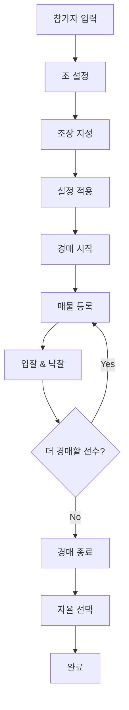

# 📖 조짜기 경매 대시보드 완전 사용 메뉴얼
# 📖 조짜기 경매 대시보드 사용 메뉴얼

## 📋 목차 (Table of Contents)

### 🎯 **개요**
- [전체 진행 흐름 개요](#전체-진행-흐름-개요)

### 📝 **1단계: 기본 설정**
- [1-1. 참가자 입력](#1-1-참가자-입력)
- [1-2. 조 설정](#1-2-조-설정)  
- [1-3. 조장 지정](#1-3-조장-지정)
- [1-4. 설정 적용](#1-4-설정-적용)

### 🏁 **2단계: 경매 시작**
- [2-1. 경매 단계 진입](#2-1-경매-단계-진입)
- [2-2. 매물 등록](#2-2-매물-등록)

### 💰 **3단계: 경매 진행**
- [3-1. 현재 경매 화면 구성](#3-1-현재-경매-화면-구성)
- [3-2. 입찰하기 상세 가이드](#3-2-입찰하기-상세-가이드)
- [3-3. 낙찰 및 경매 완료](#3-3-낙찰-및-경매-완료)

### 🎯 **4단계: 자율 선택**
- [4-1. 경매 종료](#4-1-경매-종료)
- [4-2. 자율 선택 시작](#4-2-자율-선택-시작)
- [4-3. 선수 팀 배정](#4-3-선수-팀-배정)

### 📊 **현황 모니터링**
- [팀 현황 패널](#팀-현황-패널)
- [진행 로그](#진행-로그)
- [실시간 메모](#실시간-메모)

### ⚠️ **문제 해결**
- [설정 단계 오류](#설정-단계-오류)
- [경매 단계 오류](#경매-단계-오류)
- [입찰 단계 오류](#입찰-단계-오류)
- [낙찰 단계 오류](#낙찰-단계-오류)

### 💡 **고급 활용**
- [효율적인 경매 진행](#효율적인-경매-진행)
- [조장별 전략 가이드](#조장별-전략-가이드)
- [자율 선택 단계 가이드](#자율-선택-단계-가이드)

### 🔧 **관리 도구**
- [전체 초기화](#전체-초기화)
- [로그 관리](#로그-관리)
- [메모 활용](#메모-활용)

### 📱 **기술 정보**
- [브라우저별 최적화](#브라우저별-최적화)
- [권장 시스템 환경](#권장-시스템-환경)

### 🎪 **활용 사례**
- [게임 길드 팀 구성](#게임-길드-팀-구성)
- [체육대회 조 편성](#체육대회-조-편성)
- [프로젝트 팀 구성](#프로젝트-팀-구성)

***

## 🔍 **빠른 참조 (Quick Reference)**

### ⚡ **핵심 단계 요약**
```
참가자 입력 → 조장 지정 → 경매 시작 → 매물 등록 → 입찰 → 낙찰 → 자율 선택 → 완료
```

### 🚨 **자주 발생하는 오류**
- ❌ 조장 중복 선택
- ❌ 현재가 이하 입찰
- ❌ 포인트 부족 입찰
- ❌ 빈 경매 큐에서 낙찰 시도

### 💎 **핵심 기능 위치**
- **참가자 입력**: 좌측 패널 상단
- **경매 시작**: 좌측 패널 하단
- **매물 등록**: 중앙 패널 상단
- **입찰하기**: 중앙 패널 중간
- **팀 현황**: 우측 패널 상단
- **진행 로그**: 우측 패널 하단

### ⌨️ **주요 버튼 기능**
| 버튼 | 위치 | 기능 |
|------|------|------|
| 설정 적용 & 팀 생성 | 좌측 | 초기 팀 구성 |
| 경매 시작 | 좌측 | 경매 단계 진입 |
| 경매 큐에 추가 | 중앙 | 선수를 경매 등록 |
| 입찰하기 | 중앙 | 해당 선수에게 입찰 |
| 낙찰 확정 | 중앙 | 최고 입찰자에게 낙찰 |
| 해당 경매 건너뛰기 | 중앙 | 입찰 없이 다음으로 |
| 경매 종료 | 좌측 | 경매 단계 종료 |
| 자율 선택 시작 | 좌측 | 남은 선수 팀 선택 |
| 선수 팀 배정 | 중앙 | 자율 선택 실행 |

***

**💡 팁**: 각 섹션 제목을 클릭하면 해당 내용으로 바로 이동할 수 있습니다.

**📞 문의**: 사용 중 문제가 발생하면 [문제 해결](#문제-해결) 섹션을 먼저 확인해 주세요.
## 🎯 전체 진행 흐름 개요



***

## 📝 **1단계: 기본 설정**

### **1-1. 참가자 입력**

**위치**: 좌측 패널 상단

**입력 방법**:
```
홍길동
김철수
박영희
이민수
정다은
최윤호
강서연
임준혁
오하늘
신지우
배민준
한소영
노현우
문채영
서준서
이은지
조민성
윤예린
장도현
김나연
```

**주의사항**:
- ✅ **한 줄에 한 명씩** 입력
- ✅ 정확히 **20명** 입력 권장 (최소 3명)
- ✅ 중복 이름은 자동으로 제거됨
- ❌ 공백만 있는 줄은 무시됨

**확인 방법**: "입력된 인원: X명" 숫자 확인

***

### **1-2. 조 설정**

**조 개수 설정**:
- **기본값**: 4개조
- **범위**: 2~10개조
- **계산법**: 참가자 수 ÷ 조 개수 = 조당 인원

**조당 목표 인원**:
- **기본값**: 5명
- **권장**: 3~8명
- **예시**: 20명 ÷ 4개조 = 5명씩

**실제 예시**:
```
20명 참가 시:
• 4개조 → 5명씩
• 5개조 → 4명씩  
• 3개조 → 6~7명씩
```

***

### **1-3. 조장 지정**

**절차**:
1. **참가자 입력 완료** 후 조장 선택 드롭다운 활성화
2. **각 조별로** 드롭다운에서 조장 선택
3. **모든 조장 선택** 시 "조장 설정이 완료되었습니다" 메시지 표시

**오류 상황과 해결**:
- ❌ **"조장 수가 조 개수와 일치하지 않습니다"**
  - 해결: 모든 조의 조장을 선택하세요
- ❌ **"중복된 조장이 있습니다"**
  - 해결: 다른 사람을 조장으로 선택하세요

**조장 선택 팁**:
- 💡 **경험자를 조장으로** 선정
- 💡 **골고루 분배**하여 밸런스 맞추기
- 💡 **리더십 있는 사람** 우선 고려

***

### **1-4. 설정 적용**

**"설정 적용 & 팀 생성" 버튼 클릭**

**성공 시 나타나는 변화**:
- ✅ 우측에 **팀 현황** 표시
- ✅ 각 팀마다 **1,000 포인트** 할당
- ✅ 조장이 해당 팀의 **첫 번째 멤버**로 등록
- ✅ 로그에 **"설정 적용 완료"** 메시지

**오류 시 확인사항**:
- 참가자 최소 3명 이상 입력했는가?
- 모든 조장을 선택했는가?
- 중복 조장은 없는가?

***

## 🏁 **2단계: 경매 시작**

### **2-1. 경매 단계 진입**

**"경매 시작" 버튼 클릭**

**화면 변화**:
- 📊 현재 단계: **"경매 진행"**으로 변경
- 🟢 경매 진행 상태: **"진행 중"** 표시
- 📝 로그: "경매 단계 시작" 메시지

***

### **2-2. 매물 등록**

**위치**: 중앙 패널 - "매물 등록" 섹션

**절차**:
1. **"매물(선수) 선택"** 드롭다운 클릭
2. 경매에 올릴 선수 선택
3. **"경매 큐에 추가"** 버튼 클릭

**선택 가능한 선수**:
- ✅ 아직 **팀에 배정되지 않은** 참가자만 표시
- ❌ **조장들도** 경매 대상에 포함됨
- ❌ **이미 팀에 속한** 선수는 제외

**경매 큐 테이블**:
| # | 매물(선수) | 상태 | 액션 |
|---|----------|------|------|
| 1 | 김철수    | 대기중 | [제거] |
| 2 | 박영희    | 진행중 | - |
| 3 | 이민수    | 완료 | - |

**매물 등록 팁**:
- 💡 **인기 선수부터** 먼저 등록
- 💡 **5~10명 정도** 미리 큐에 등록
- 💡 **밸런스를 고려**하여 다양한 타입 등록

***

## 💰 **3단계: 경매 진행**

### **3-1. 현재 경매 화면 구성**

**현재 경매 정보**:
- 🏷 **선수**: 경매 중인 선수 이름
- 💵 **현재가**: 현재 최고 입찰 금액
- 👤 **최고 입찰자**: 현재 최고가를 제시한 조장

**입찰 인터페이스**:
- 📋 **입찰할 조장**: 드롭다운에서 조장 선택
- 💰 **입찰 금액**: 숫자 입력 필드
- 🔔 **입찰하기**: 입찰 실행 버튼

***

### **3-2. 입찰하기 상세 가이드**

**입찰 절차**:
1. **조장 선택**: 입찰할 팀의 조장 선택
2. **금액 입력**: 현재가보다 높은 금액 입력
3. **입찰하기 클릭**: 입찰 실행

**입찰 금액 규칙**:
```
현재가: 0p → 최소 입찰: 1p 이상
현재가: 150p → 최소 입찰: 151p 이상
현재가: 500p → 최소 입찰: 501p 이상
```

**입찰 제한 조건**:
- ❌ **현재가 이하**: "현재가보다 높은 금액을 입력하세요"
- ❌ **포인트 부족**: "잔여 포인트(XXX)가 부족합니다"
- ❌ **목표 인원 초과**: 경고 후 확인 시 진행 가능

**성공적인 입찰 예시**:
```
1조 (홍길동) → 김철수 @ 200p
2조 (박영희) → 김철수 @ 350p  ← 현재 최고가
3조 (이민수) → 김철수 @ 400p  ← 새로운 최고가
```

***

### **3-3. 낙찰 및 경매 완료**

**낙찰 처리**:
1. **"낙찰 확정"** 버튼 클릭
2. 최고 입찰자의 팀에 해당 선수 배정
3. 입찰 금액만큼 포인트 차감
4. 다음 경매 자동 시작

**낙찰 후 변화**:
- 👥 **팀 현황**: 해당 팀에 선수 추가
- 💰 **포인트**: 입찰 금액만큼 차감
- 📋 **큐 상태**: "완료"로 변경
- 📝 **로그**: 낙찰 기록 추가

**경매 건너뛰기**:
- **"해당 경매 건너뛰기"** 클릭
- 입찰 없이 다음 경매로 진행
- 해당 선수는 자율 선택 단계로 이월

**실제 낙찰 예시**:
```
낙찰: 김철수 → 3조(이민수) @ 400p

변화:
• 3조 포인트: 1,000p → 600p
• 3조 구성원: 이민수, 김철수 (2명)
• 김철수는 더 이상 경매 대상 아님
```

***

## 🎯 **4단계: 자율 선택**

### **4-1. 경매 종료**

**경매 종료 조건**:
- 모든 큐의 경매가 완료됨
- 또는 **"경매 종료"** 버튼으로 강제 종료

**경매 종료 절차**:
1. **"경매 종료"** 버튼 클릭
2. 진행 중인 경매가 있다면 확인 메시지
3. 단계가 **"대기"**로 변경

***

### **4-2. 자율 선택 시작**

**"자율 선택 시작" 버튼 클릭**

**화면 변화**:
- 📊 현재 단계: **"자율 선택"**
- 🟡 자율 선택 단계: **"진행 중"**
- 📋 드롭다운에 **남은 선수들만** 표시

***

### **4-3. 선수 팀 배정**

**배정 절차**:
1. **"남은 선수 선택"**: 아직 팀에 속하지 않은 선수 선택
2. **"입단할 팀 선택"**: 원하는 팀 선택
3. **"선수 팀 배정"** 버튼 클릭

**자율 선택 예시**:
```
남은 선수: 정다은, 최윤호, 강서연

정다은의 선택:
• 1조 (홍길동) - 현재 3명
• 2조 (박영희) - 현재 4명  ← 선택
• 3조 (이민수) - 현재 5명
• 4조 (최윤호) - 현재 4명

결과: 정다은 → 2조 배정
```

***

## 📊 **현황 모니터링**

### **팀 현황 패널**

**표시 정보**:
- 🏷 **팀명**: 1조, 2조, 3조, 4조
- 👑 **조장**: 각 팀의 조장 이름
- 💰 **잔여 포인트**: 1,000p에서 차감된 금액
- 👥 **현재 인원**: 배정된 멤버 수 / 목표 인원
- 📋 **구성원 목록**: 조장 + 경매/자율 선택으로 영입된 선수들

**팀 현황 예시**:
```
1조
조장: 홍길동
포인트: 650p
인원: 4/5명
구성원:
├ 홍길동 (조장)
├ 김철수 [350p]
├ 박영희 [0p] 자율선택
└ 이민수 [0p] 자율선택
```

***

### **진행 로그**

**기록되는 내용**:
- ⏰ **시간**: 각 액션의 정확한 시간
- 📝 **내용**: 경매 등록, 입찰, 낙찰, 자율 선택 등
- 💰 **금액**: 입찰가, 낙찰가 정보

**로그 예시**:
```
[17:45:23] 경매 시작 - 원하는 선수를 경매에 올려주세요
[17:45:35] 경매 등록: 김철수
[17:45:42] 경매 시작: 김철수
[17:45:58] 입찰: 홍길동 → 김철수 @ 200p
[17:46:15] 입찰: 박영희 → 김철수 @ 350p
[17:46:28] 낙찰: 김철수 → 1조(홍길동) @ 350p
[17:46:35] 자율 선택: 정다은 → 2조(박영희)
```

***

### **실시간 메모**

**사용법**:
- 📝 경매 진행 중 메모 작성
- 💭 전략, TODO, 특이사항 기록
- 🗑 **"메모 초기화"**로 내용 삭제

**메모 활용 예시**:
```
경매 진행 메모:
- 김철수: 인기 많음, 400p 예상
- 박영희: 2조에서 원함
- 이민수: 조용히 지켜보는 중
- 3조 포인트 부족 주의

TODO:
□ 5라운드 후 중간 점검
□ 밸런스 확인
□ 남은 포인트 계산
```

***

## ⚠️ **오류 상황 및 해결법**

### **설정 단계 오류**

**"참가자를 최소 3명 이상 입력해주세요"**
- **원인**: 참가자 입력이 부족
- **해결**: 텍스트박스에 더 많은 이름 추가

**"조장 설정을 완료해주세요"**
- **원인**: 일부 조의 조장이 선택되지 않음
- **해결**: 모든 조의 조장 드롭다운에서 선택

**"중복된 조장이 있습니다"**
- **원인**: 같은 사람이 여러 조의 조장으로 선택됨
- **해결**: 다른 사람으로 조장 변경

***

### **경매 단계 오류**

**"경매 단계에서만 매물을 등록할 수 있습니다"**
- **원인**: 경매를 시작하지 않고 매물 등록 시도
- **해결**: "경매 시작" 버튼 먼저 클릭

**"이미 경매 큐에 등록된 선수입니다"**
- **원인**: 같은 선수를 중복으로 큐에 추가
- **해결**: 다른 선수 선택 또는 기존 큐에서 제거 후 재등록

**"이미 팀에 배정된 선수입니다"**
- **원인**: 이미 낙찰된 선수를 다시 경매에 올리려 함
- **해결**: 아직 팀에 속하지 않은 선수만 선택

***

### **입찰 단계 오류**

**"진행 중인 경매가 없습니다"**
- **원인**: 경매 큐가 비어있거나 경매가 시작되지 않음
- **해결**: 매물을 먼저 경매 큐에 등록

**"입찰할 조장을 선택해주세요"**
- **원인**: 조장 선택 없이 입찰 시도
- **해결**: 드롭다운에서 조장 선택

**"현재가(XXX)보다 높은 금액을 입력해주세요"**
- **원인**: 현재가 이하의 금액 입찰
- **해결**: 현재가 + 1 이상의 금액 입력

**"잔여 포인트(XXX)가 부족합니다"**
- **원인**: 팀의 잔여 포인트보다 높은 금액 입찰
- **해결**: 잔여 포인트 이하의 금액으로 입찰

***

### **낙찰 단계 오류**

**"입찰자가 없습니다. 먼저 입찰을 진행해주세요"**
- **원인**: 아무도 입찰하지 않은 상태에서 낙찰 시도
- **해결**: 최소 1번의 입찰 후 낙찰 또는 "건너뛰기" 선택

**"유효하지 않은 팀입니다"**
- **원인**: 시스템 오류로 팀 정보가 손상됨
- **해결**: 페이지 새로고침 후 다시 설정

***

## 💡 **고급 사용 팁**

### **효율적인 경매 진행**

**1. 사전 준비**
- 📋 참가자 명단을 미리 정리
- 📊 조별 목표 인원 수 계산
- 🎯 인기 선수 예상 및 전략 수립

**2. 경매 순서 전략**
```
추천 순서:
1단계: 핵심 선수들 (예상 가격 300p 이상)
2단계: 중간급 선수들 (예상 가격 100-300p)
3단계: 나머지 선수들 (예상 가격 100p 이하)
```

**3. 포인트 관리**
- 💰 **초반**: 핵심 선수에 과감한 투자
- 💰 **중반**: 밸런스 고려한 신중한 입찰
- 💰 **후반**: 잔여 포인트로 빈 자리 채우기

***

### **조장별 전략 가이드**

**공격적 전략**
- 💥 초반에 **고액 입찰**로 핵심 선수 확보
- 💥 **2-3명**의 핵심 선수에 집중 투자
- 💥 나머지는 **자율 선택**에 의존

**밸런스 전략**
- ⚖️ **중간 금액**으로 꾸준히 입찰
- ⚖️ **4-5명**을 골고루 영입
- ⚖️ **안정적인** 팀 구성

**수비적 전략**
- 🛡️ **저가 입찰**로 다수 확보
- 🛡️ **6-7명**을 경매로 영입
- 🛡️ **포인트 효율성** 중시

***

### **자율 선택 단계 가이드**

**선수 입장에서의 팀 선택 기준**
1. **팀 분위기**: 원하는 조장/멤버와 함께
2. **팀 밸런스**: 너무 많거나 적지 않은 인원
3. **개인 선호**: 친한 사람들이 있는 팀

**조장 입장에서의 어필 포인트**
- 🎯 **팀 컨셉** 어필 (예: "재미있게 하자", "열심히 하자")
- 🎯 **남은 자리** 정보 제공
- 🎯 **팀 분위기** 소개

***

## 🔧 **관리자 도구**

### **전체 초기화**
- 🗑️ **"전체 초기화"** 버튼으로 모든 데이터 삭제
- ⚠️ **확인 메시지** 후 진행
- 🔄 처음 상태로 완전 복구

**초기화 시점 권장**:
- 테스트 완료 후
- 새로운 그룹으로 다시 시작할 때
- 오류 발생으로 재시작이 필요할 때

***

### **로그 관리**
- 📋 **"로그 초기화"**: 진행 기록만 삭제
- 📊 로그는 **최대 50개**까지 저장
- ⏰ 시간순으로 **최신이 위로** 정렬

***

### **메모 활용**
- 📝 경매 중 **실시간 메모** 작성
- 🗂️ **전략, 관찰사항, TODO** 기록
- 🗑️ **"메모 초기화"**로 즉시 삭제

***

## 📱 **브라우저별 최적화**

### **권장 브라우저**
- ✅ **Chrome** (최신 버전)
- ✅ **Firefox** (최신 버전)
- ✅ **Safari** (macOS)
- ✅ **Edge** (Windows)

### **브라우저 설정**
- 🔍 **확대/축소**: 100% 권장
- 📱 **반응형**: 최소 1200px 폭 권장
- 🖱️ **JavaScript**: 반드시 활성화

***

## 🎪 **실제 사용 시나리오**

### **게임 길드 팀 구성**
```
상황: 20명 길드원을 4개 공격대로 편성

1. 공격대장 4명을 조장으로 지정
2. 핵심 딜러들을 경매로 영입
3. 힐러, 탱커 밸런스 고려
4. 나머지는 자율 선택으로 마무리

결과: 밸런스 잡힌 4개 공격대 완성
```

### **체육대회 조 편성**
```
상황: 학교 체육대회 20명을 4개 조로 편성

1. 체육 잘하는 학생 4명을 조장으로
2. 운동 능력자들을 경매로 확보
3. 포지션별 밸런스 맞추기
4. 친목 고려한 자율 선택

결과: 경쟁력과 친목 모두 고려한 조 편성
```

### **프로젝트 팀 구성**
```
상황: 개발 프로젝트 20명을 4개 팀으로 편성

1. 팀장급 개발자 4명을 조장으로
2. 핵심 기술자들을 경매로 영입
3. 프론트엔드/백엔드 밸런스 고려
4. 협업 선호도 고려한 자율 선택

결과: 기술 역량과 팀워크 균형잡힌 팀 구성
```

***

이 메뉴얼을 따라하시면 조짜기 경매를 성공적으로 진행할 수 있습니다! 

**💬 추가 질문이나 문제가 있으시면 언제든 문의해 주세요.**